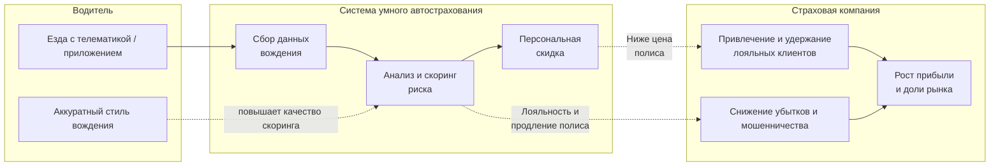
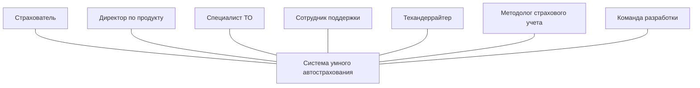
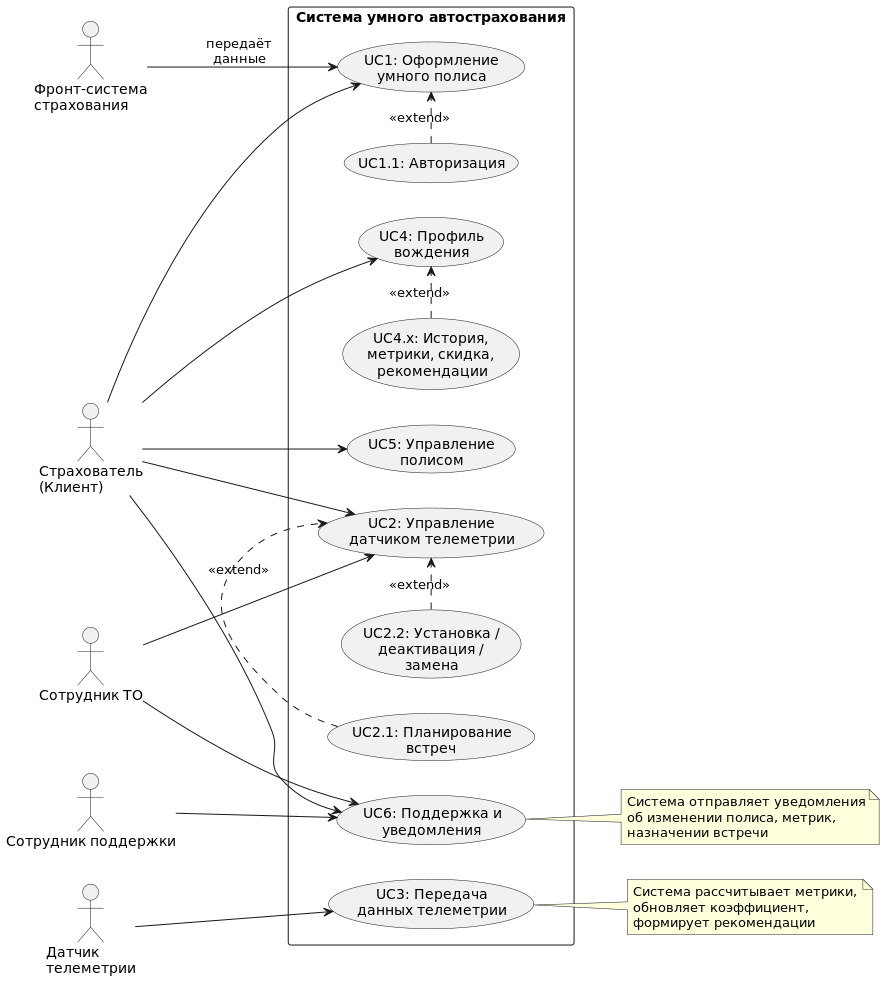

# Система умного страхования авто  проект для курса Software Architect

##
**Автор: Березюк Денис**

## Содержание

- [Бизнес-кейс](#бизнес-кейс)
- [Бизнес-драйверы](#бизнес-драйверы)
- [Бизнес-цели](#бизнес-цели)
- [Требования к системе](#требования-к-системе)
    - [Стейкхолдеры](#стейкхолдеры)
    - [Функциональные требования](#функциональные-требования)

## Бизнес-кейс
Рассматриваемая компания - коммерческая российская страховая группа с универсальным портфелем услуг, включающий в себя как портфель страховых продуктов для частных лиц, так и комплексные программы защиты интересов бизнеса. Является одним из лидеров среди частных страховых компанией на рынке.
Ключевые цифры:
* Клиенты – 15 млн.;
* Доля рынка – 13%;
* Сборы зв 2025 год – 250 млрд. руб.
* Представлена в 33 регионах Российской Федерации.

Страховая компания заинтересована в росте доли “безубыточных” лояльных клиентов по всем продуктам страхования, в особенности автострахования, так как, по статистике, именно в автостраховании (КАСКО, ОСАГО в РФ) наибольший % страховых случаев, а также наибольшая доля мошеннических схем. Для удержания и привлечения таких клиентов, компания готова давать скидку до 25% на полисы для аккуратных водителей. С другой стороны, ответственные и аккуратные клиенты-водители заинтересованы в скидках от страховщиков при аккуратном стиле вождения.

Для решения данной бизнес-задачи страховщик решает разработать систему Умного Автострахования Авто. Мотивация разработки системы представлена на схеме ниже 

<!-- #region mermaid: мотивация системы умного автострахования -->

<!-- #endregion -->

## Бизнес-драйверы

* Рост лояльности в продуктах авто
За счет простой и понятной логике для клиентов: "чем аккуратнее стиль вождения, тем выгоднее автострахование"
* Снижение убыточности в портфеле автострахования
За счет отбора и удержания безубыточних клиентов
* Борьба с мошенничеством и серой статистикой
Телематика позволяет укрепить data-driven подход к скорингу клиентов

## Бизнес-цели

* Уменьшить совокупный коэффициент убыточности по автострахованию на 10 п.п. после 2 года с начала эксплуатации системы
* Увеличить долю безубыточных клиентов и их удержание на 20% через 3 года

## Требования к системе

### Стейкхолдеры

Ключевые заинтересованные лица с кратким описанием наиболее важных для них атрибутов качества системы

* **SH-1**: **Страхователь** (Доступность, Удобство пользования, Прозрачность)
    - Клиент, оформивший "умный" полис автострахования и эксплуатирующий датчик телеметрии на своем авто;
    - Хочет *доступности* системы для просмотра поездок с метриками в любое время суток;
    - Хочет интуитивно понятный интерфейс и пользовательские сценарии в приложения (*удобство пользования*);
    - Хочет *прозрачности* в расчете метрик стиля вождения, которые влияют на стоимость полиса страхования.

* **SH-2**: **Директор по продукту** (Масштабируемость, Модифицируемость, Удобство пользования)
    - Ключевой заказчик и инвестор, является визионером данной системы;
    - Хочет *масштабируемую* систему при успешных PoC's;
    - Хочет *модифицируемую* систему, чтобы быстро тестировать продуктовые гипотезы в системе;
    - Хочет интуитивный интерфейс для ключевых пользователей, чтобы иметь конкурентное преимущество на рынке (*удобство пользования*). 

* **SH-3**: **Специалист ТО** (Производительность, Доступность, Удобство пользования)
    - Устанавливает датчик телеметрии в авто страхователей и авторизовывает датчик в системе для начала эксплуатации;
    - Хочет, чтобы операции были быстрыми для пропускной способности (*производительность*);
    - Хочет *доступности* приложения в любой время;
    - Хочет стандартизированные и простые сценарии для работы с телеметрией (*удобство пользования*).

* **SH-4**: **Сотрудник поддержки** (Доступность, Интегрируемость, Целостность данных)
    - Работаюет в омниканальной платформе поддержки. Решает типовые обращения клиентов, переводит нетиповые на третью линию поддержки;
    - Хочет *доступности* системы 24/7 для круглосуточной возможности обработки обращений от клиентов;
    - Хочет работать с обращениями новой системы в омниканальой платформе (*интеграция*);
    - Хочет *целостности данных*, чтобы обращения не терялись и их данные актуально обновлялись.

* **SH-5**: **Техандеррайтеры** (Прозрачность, Точность, Модифицируемость)
    - Ставят требования и разрабатывают методологию ценообразования полисов и выплат;
    - Хотят *прозрачности* и *точности* в расчете метрик, коэффициента стиля вождения и их влияния на стоимость полиса;
    - Хотят *модицицируемость* бизнес-логики расчетов, так как требования будут часто меняться/добавляться.

* **SH-6**: **Методолог страхового учета** (Аудируемость, Целостность данных, Интегрируемость)
    - Ставит требования к учету полисов для страхового учета, а также проводит аудит;
    - Хочет *аудируемость* системы для качественной и прозрачной аналитики;
    - Хочет *целостность данных* между системами умного автострахования и страхового учета;
    - Хочет *интегрируемости* с системой страхового учета.

* **SH-7**: **Команда разработки системы усного автострахования** (Модифицируемость, Масштабируемость, Тестируемость)
    - Разрабатывает систему умного автострахования "с нуля"
    - Хочет, чтобы система была *модифицируема* относительно новых требований;
    - Хочет, чтобы система была *масштабируема*;
    - Хочет, чтобы сложная бизнес-логика метрик стиля вождения была *тестируема*

<!-- #region mermaid: SH системы умного автострахования -->

<!-- #endregion -->

### Функциональные требования

Представлены в виде вариантов использования системы (Use-cases) ключевыми стейкхолдерами

* **UC-1**: **Оформление умного полиса**:
    - Клиент через одну из фронт-систем Страховщика оформляет полис автострахования с динамичным ценообразованием ("умный полис") (SH-1);
    - Фронт-система передает данные о клиенте (страхователе) и его авто в Систему умного автострахования;
    - Клиент авторизовывается в приложении умного автострахования (SH-1)

* **UC-2**: **Инициация встречи для установки/дективации/замены датчика телеметрии**
    - Клиент выбирает установку/деактивацию/замены датчика телеметрии на своем авто (SH-1);
    - Клиент в приложении выбирает сервис партнера ТО, а также время приема (SH-1);
    - Клиент может отредактировать выбор (SH-1);
    - Сотрудник ТО авторизовывается в приложении (SH-3);
    - У сотрудника ТО в личном кабинете появляется информация о визите (SH-3);
    - Сотрудник ТО подтверждает/не подтверждает встречу (SH-3).

* **UC-3**: **Установка/Деакцтивация и авторизация датчика телеметрии**
    - Сотрудник ТО устанавливает/деактивирует/замены датчик в/из авто страхователя (SH-3);
    - Сотрудник ТО в личном кабинете фиксирует установку/деактивацию/замену датчика (SH-3);
    - Клиент подтверждает в приложении установку/деактивацию/замену датчика (SH-1);

* **UC-4**: **Эксплуатация датчика телеметрии**
    - Клиент водит авто, датчик отправляет необходимые данные телеметрии в контур страховщика (SH-1);
    - Система формирует и рассчитывает метрики стиля вождения для каждой завершенной поездки;
    - Система обновляет метрики и коэффициент стиля вождения клиента и прогнозную стоимость полиса со скидкой каждую ночь;
    - Система производит изменения в страховом полисе при изменении его стоимости согласно коэффициенту стиля вождения;
    - Система формирует рекомендации для клиента по стилю вождения в привязки к конкретным локациям;
    - Система уведомляет клиента и поддержку при наличии проблем со связью/качеством датчика телеметрии.

* **UC-5**: **Просмотр профиля вождения**
    - Клиент просматривает список завершенных поездок с их метриками стиля вождения с возможностью открыть каждую поездку (SH-1);
    - Клиент просматривает текущие метрики и коэффициент стиля вождения (SH-1);
    - Клиент просматривает наиболее весомые причины текущего значения метрик и коэффициента (исторические поездки) (SH-1); 
    - Клиент просматривает прогнозную стоимость своего полиса на следующий месяц (SH-1);
    - Клиент просматривает рекомендации по стилю вождения на основе данных за месяц (SH-1).

* **UC-6**: **Управление умным полисом и профилем в приложении**
    - Клиент просматривает информацию по своему авто и полису страхования в личном кабинете (SH-1);
    - Клиент отключает функцию динамического образования ("умного" полиса) (SH-1);
    - Клиент редактирует персональную информацию в личном кабинете (почта, телефон) (SH-1).

* **UC-7**: **Работа с поддержкой**
    - Клиент формирует обращение на поддержку в виде сообщения/звонка в приложении (SH-1);
    - Клиент отвечает на вопросы сотрудника поддержки в виде сообщения/звонка (SH-1);
    - Клиент не соглашается с закрытием обращения в виде сообщения/звонка (SH-1);
    - Клиент оценивает качество закрытия обращения (SH-1).

* **UC-8**: **Уведомления в приложении**
    - Клиент/Сотрудник ТО настраивает в личном кабинете предпочтительный способ уведомлений (SMS/пуш в приложении/E-mail) (SH-1,3);
    - Клиент получает уведомление об изменении полиса/метрик/коэффициента (SH-1);
    - Сотрудник ТО получает уведомление о назначении встречи (SH-3).

