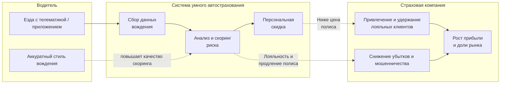

# Система умного страхования авто  проект для курса Software Architect

##
**Автор: Березюк Денис**

## Содержание

## Бизнес-кейс
Рассматриваемая компания - коммерческая российская страховая группа с универсальным портфелем услуг, включающий в себя как портфель страховых продуктов для частных лиц, так и комплексные программы защиты интересов бизнеса. Является одним из лидеров среди частных страховых компанией на рынке.
Ключевые цифры:
* Клиенты – 15 млн.;
* Доля рынка – 13%;
* Сборы зв 2025 год – 250 млрд. руб.
* Представлена в 33 регионах Российской Федерации.

Страховая компания заинтересована в росте доли “безубыточных” лояльных клиентов по всем продуктам страхования, в особенности автострахования, так как, по статистике, именно в автостраховании (КАСКО, ОСАГО в РФ) наибольший % страховых случаев, а также наибольшая доля мошеннических схем. Для удержания и привлечения таких клиентов, компания готова давать скидку до 25% на полисы для аккуратных водителей. С другой стороны, ответственные и аккуратные клиенты-водители заинтересованы в скидках от страховщиков при аккуратном стиле вождения.

Для решения данной бизнес-задачи страховщик решает разработать систему Умного Автострахования Авто. Мотивация разработки системы представлена на схеме ниже 

<!-- #region mermaid: мотивация системы умного автострахования -->

<!-- #endregion -->

## Бизнес-драйверы

* Рост лояльности в продуктах авто
За счет простой и понятной логике для клиентов: "чем аккуратнее стиль вождения, тем выгоднее автострахование"
* Снижение убыточности в портфеле автострахования
За счет отбора и удержания безубыточних клиентов
* Борьба с мошенничеством и серой статистикой
Телематика позволяет укрепить data-driven подход к скорингу клиентов

## Бизнес-цели

* Уменьшить совокупный коэффициент убыточности по автострахованию на 10 п.п. после 2 года с начала эксплуатации системы
* Увеличить долю безубыточных клиентов и их удержание на 20% через 3 года

## Требования к системе

