# Система умного страхования авто  проект для курса Software Architect

##
**Автор: Березюк Денис**

## Содержание

- [Бизнес-кейс](#бизнес-кейс)
- [Бизнес-драйверы](#бизнес-драйверы)
- [Бизнес-цели](#бизнес-цели)
- [Требования к системе](#требования-к-системе)
    - [Стейкхолдеры](#стейкхолдеры)
    - [Функциональные требования](#функциональные-требования)
    - [Атрибуты качества](#атрибуты-качества)
    - [Допущения](#допущения)
    - [Ограничения](#ограничения)
- [Архитектура](#архитектура)
    - [Модель предметной области](#модель-предметной-области)
    - [Архитектурно значимые требования и критические сценарии](#архитектурно-значимые-требования-и-критические-сценарии)
    - [Выбор архитектурного стиля](#выбор-архитектурного-стиля)
    - [Контекст](#контекст)
    - [Контейнеры](#контейнеры)

## Бизнес-кейс
Рассматриваемая компания - коммерческая российская страховая группа с универсальным портфелем услуг, включающий в себя как портфель страховых продуктов для частных лиц, так и комплексные программы защиты интересов бизнеса. Является одним из лидеров среди частных страховых компанией на рынке.
Ключевые цифры:
* Клиенты – 15 млн.;
* Доля рынка – 13%;
* Сборы зв 2025 год – 250 млрд. руб.
* Представлена в 33 регионах Российской Федерации.

Страховая компания заинтересована в росте доли “безубыточных” лояльных клиентов по всем продуктам страхования, в особенности автострахования, так как, по статистике, именно в автостраховании (КАСКО, ОСАГО в РФ) наибольший % страховых случаев, а также наибольшая доля мошеннических схем. Для удержания и привлечения таких клиентов, компания готова давать скидку до 25% на полисы для аккуратных водителей. С другой стороны, ответственные и аккуратные клиенты-водители заинтересованы в скидках от страховщиков при аккуратном стиле вождения.

Для решения данной бизнес-задачи страховщик решает разработать систему Умного Автострахования Авто. Мотивация разработки системы представлена на схеме ниже 

<!-- #region mermaid: мотивация системы умного автострахования -->
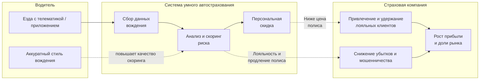
```mermaid
flowchart LR
    subgraph DRIVER["Водитель"]
        D1[Езда с телематикой / приложением]
        D2[Аккуратный стиль вождения]
    end
    subgraph SYSTEM["Система умного автострахования"]
        S1[Сбор данных<br>вождения]
        S2[Анализ и скоринг<br>риска]
        S3[Персональная<br>скидка]
    end
    subgraph INSURER["Страховая компания"]
        I1[Привлечение и удержание<br>лояльных клиентов]
        I2[Снижение убытков и мошенничества]
        I3[Рост прибыли<br>и доли рынка]
    end
    D1 --> S1 --> S2 --> S3
    D2 -. "повышает качество скоринга" .-> S2
    S3 -. "Ниже цена<br>полиса" .-> I1
    S2 -. "Лояльность и<br>продление полиса" .-> I2
    I1 --> I3
    I2 --> I3
```
<!-- #endregion -->

## Бизнес-драйверы

* Рост лояльности в продуктах авто
За счет простой и понятной логике для клиентов: "чем аккуратнее стиль вождения, тем выгоднее автострахование"
* Снижение убыточности в портфеле автострахования
За счет отбора и удержания безубыточних клиентов
* Борьба с мошенничеством и серой статистикой
Телематика позволяет укрепить data-driven подход к скорингу клиентов

## Бизнес-цели

* Уменьшить совокупный коэффициент убыточности по автострахованию на 10 п.п. после 2 года с начала эксплуатации системы
* Увеличить долю безубыточных клиентов и их удержание на 20% через 3 года

## Требования к системе

### Стейкхолдеры

Ключевые заинтересованные лица с кратким описанием наиболее важных для них атрибутов качества системы

* **SH-1**: **Страхователь** (Доступность, Удобство пользования, Прозрачность)
    - Клиент, оформивший "умный" полис автострахования и эксплуатирующий датчик телеметрии на своем авто;
    - Хочет *доступности* системы для просмотра поездок с метриками в любое время суток;
    - Хочет интуитивно понятный интерфейс и пользовательские сценарии в приложения (*удобство пользования*);
    - Хочет *прозрачности* в расчете метрик стиля вождения, которые влияют на стоимость полиса страхования.

* **SH-2**: **Директор по продукту** (Масштабируемость, Модифицируемость, Удобство пользования)
    - Ключевой заказчик и инвестор, является визионером данной системы;
    - Хочет *масштабируемую* систему при успешных PoC's;
    - Хочет *модифицируемую* систему, чтобы быстро тестировать продуктовые гипотезы в системе;
    - Хочет интуитивный интерфейс для ключевых пользователей, чтобы иметь конкурентное преимущество на рынке (*удобство пользования*). 

* **SH-3**: **Специалист ТО** (Производительность, Доступность, Удобство пользования)
    - Устанавливает датчик телеметрии в авто страхователей и авторизовывает датчик в системе для начала эксплуатации;
    - Хочет, чтобы операции были быстрыми для пропускной способности (*производительность*);
    - Хочет *доступности* приложения в любой время;
    - Хочет стандартизированные и простые сценарии для работы с телеметрией (*удобство пользования*).

* **SH-4**: **Сотрудник поддержки** (Доступность, Интегрируемость, Целостность данных)
    - Работаюет в омниканальной платформе поддержки. Решает типовые обращения клиентов, переводит нетиповые на третью линию поддержки;
    - Хочет *доступности* системы 24/7 для круглосуточной возможности обработки обращений от клиентов;
    - Хочет работать с обращениями новой системы в омниканальой платформе (*интеграция*);
    - Хочет *целостности данных*, чтобы обращения не терялись и их данные актуально обновлялись.

* **SH-5**: **Техандеррайтеры** (Прозрачность, Точность, Модифицируемость)
    - Ставят требования и разрабатывают методологию ценообразования полисов и выплат;
    - Хотят *прозрачности* и *точности* в расчете метрик, коэффициента стиля вождения и их влияния на стоимость полиса;
    - Хотят *модифицируемость* бизнес-логики расчетов, так как требования будут часто меняться/добавляться.

* **SH-6**: **Методолог страхового учета** (Аудируемость, Целостность данных, Интегрируемость)
    - Ставит требования к учету полисов для страхового учета, а также проводит аудит;
    - Хочет *аудируемость* системы для качественной и прозрачной аналитики;
    - Хочет *целостность данных* между системами умного автострахования и страхового учета;
    - Хочет *интегрируемости* с системой страхового учета.

* **SH-7**: **Команда разработки системы усного автострахования** (Модифицируемость, Масштабируемость, Тестируемость)
    - Разрабатывает систему умного автострахования "с нуля"
    - Хочет, чтобы система была *модифицируема* относительно новых требований;
    - Хочет, чтобы система была *масштабируема*;
    - Хочет, чтобы сложная бизнес-логика метрик стиля вождения была *тестируема*

<!-- #region mermaid: SH системы умного автострахования -->
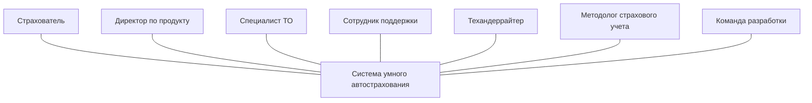
```mermaid
flowchart TD
    System["Система умного автострахования"]
    SH1["Страхователь"]
    SH2["Директор по продукту"]
    SH3["Специалист ТО"]
    SH4["Сотрудник поддержки"]
    SH5["Техандеррайтер"]
    SH6["Методолог страхового учета"]
    SH7["Команда разработки"]

    SH1 --- System
    SH2 --- System
    SH3 --- System
    SH4 --- System
    SH5 --- System
    SH6 --- System
    SH7 --- System
```
<!-- #endregion -->

### Функциональные требования

Представлены в виде вариантов использования системы (Use-cases) ключевыми стейкхолдерами

* **UC-1**: **Оформление умного полиса**:
    - Клиент через одну из фронт-систем Страховщика оформляет полис автострахования с динамичным ценообразованием ("умный полис") (SH-1);
    - Фронт-система передает данные о клиенте (страхователе) и его авто в Систему умного автострахования;
    - Клиент авторизовывается в приложении умного автострахования (SH-1)

* **UC-2**: **Инициация встречи для установки/дективации/замены датчика телеметрии**
    - Клиент выбирает установку/деактивацию/замены датчика телеметрии на своем авто (SH-1);
    - Клиент в приложении выбирает сервис партнера ТО, а также время приема (SH-1);
    - Клиент может отредактировать выбор (SH-1);
    - Сотрудник ТО авторизовывается в приложении (SH-3);
    - У сотрудника ТО в личном кабинете появляется информация о визите (SH-3);
    - Сотрудник ТО подтверждает/не подтверждает встречу (SH-3).

* **UC-3**: **Установка/Деакцтивация и авторизация датчика телеметрии**
    - Сотрудник ТО устанавливает/деактивирует/замены датчик в/из авто страхователя (SH-3);
    - Сотрудник ТО в личном кабинете фиксирует установку/деактивацию/замену датчика (SH-3);
    - Клиент подтверждает в приложении установку/деактивацию/замену датчика (SH-1);

* **UC-4**: **Эксплуатация датчика телеметрии**
    - Клиент водит авто, датчик отправляет необходимые данные телеметрии в контур страховщика (SH-1);
    - Система формирует и рассчитывает метрики стиля вождения для каждой завершенной поездки;
    - Система обновляет метрики и коэффициент стиля вождения клиента и прогнозную стоимость полиса со скидкой каждую ночь;
    - Система производит изменения в страховом полисе при изменении его стоимости согласно коэффициенту стиля вождения;
    - Система формирует рекомендации для клиента по стилю вождения в привязки к конкретным локациям;
    - Система уведомляет клиента и поддержку при наличии проблем со связью/качеством датчика телеметрии.

* **UC-5**: **Просмотр профиля вождения**
    - Клиент просматривает список завершенных поездок с их метриками стиля вождения с возможностью открыть каждую поездку (SH-1);
    - Клиент просматривает текущие метрики и коэффициент стиля вождения (SH-1);
    - Клиент просматривает наиболее весомые причины текущего значения метрик и коэффициента (исторические поездки) (SH-1); 
    - Клиент просматривает прогнозную стоимость своего полиса на следующий месяц (SH-1);
    - Клиент просматривает рекомендации по стилю вождения на основе данных за месяц (SH-1).

* **UC-6**: **Управление умным полисом и профилем в приложении**
    - Клиент просматривает информацию по своему авто и полису страхования в личном кабинете (SH-1);
    - Клиент отключает функцию динамического образования ("умного" полиса) (SH-1);
    - Клиент редактирует персональную информацию в личном кабинете (почта, телефон) (SH-1).

* **UC-7**: **Работа с поддержкой**
    - Клиент формирует обращение на поддержку в виде сообщения/звонка в приложении (SH-1);
    - Клиент отвечает на вопросы сотрудника поддержки в виде сообщения/звонка (SH-1);
    - Клиент не соглашается с закрытием обращения в виде сообщения/звонка (SH-1);
    - Клиент оценивает качество закрытия обращения (SH-1).

* **UC-8**: **Уведомления в приложении**
    - Клиент/Сотрудник ТО настраивает в личном кабинете предпочтительный способ уведомлений (SMS/пуш в приложении/E-mail) (SH-1,3);
    - Клиент получает уведомление об изменении полиса/метрик/коэффициента (SH-1);
    - Сотрудник ТО получает уведомление о назначении встречи (SH-3).

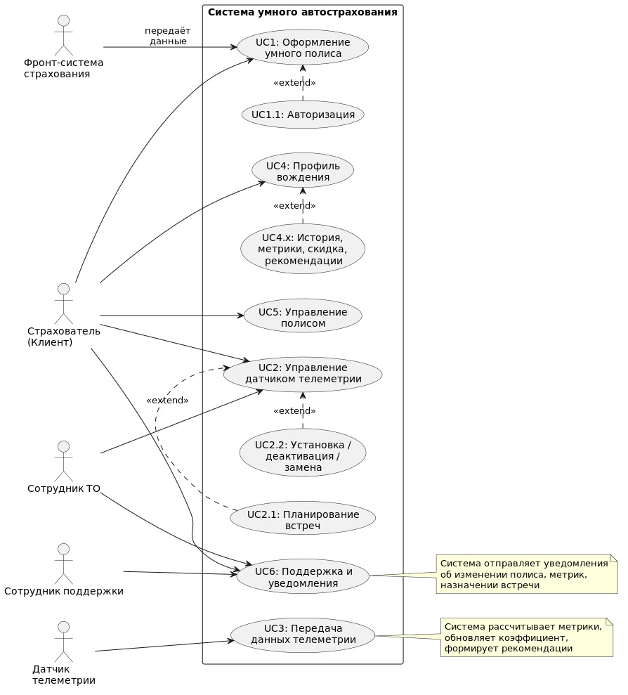

### Атрибуты качества

* **QA-1**: **Масштабируемость** (UC-4, UC-1)
    - кол-во пользователей с 1 до 100 тыс. на горизоонте до ~2-х лет;
    - кол-во поездок в день в среднем на пользователя до ~3;
    - кол-во точек телеметрии на поездку до ~ ;
    - кол-во специалистов ТО по сервисам-партнерам до ~1000;
    - география приложения: все регионы РФ, где доступна сотовая связь;

* **QA-2**: **Удобство пользования** (UC-1, UC-5, UC-6, UC-2, UC-3)
    - риск не удержать клиента при неудобном UX на всем ЖЦ процесса;
    - риск некорректной установки датчика телеметрии при неудобном UX;
    - *не является ключевым атрибутом качества* на старте продукта, так как функциональность и стабильность приоритетнее идеального UI/UX, который будет дорабатываться согласно ОС ключевых пользователей.

* **QA-3**: **Доступность** (UC-7, UC-6, UC-4)
    - недоступность функций профиля вождения может ввести клиентов в заблуждение и снизить доверие к системе;
    - недоступноть функций поддержки тоже снизит доверие к системе4
    - необходимый уровеь доступности 99,9%;
    - БД основных доменов должны быть отказоустойчивы за счет реплицирования.

* **QA-4**: **Безопасность** (UC-4)
    - данные телеметрии не должны попадать в руки третьих лиц;
    - данные телеметрии должны быть зашифрованы;
    - данные телеметрии должны храниться в защищенном кластере в контуре страховщика;
    - *не является ключевым атрибутом качества* на старте продукта, так как на начальном этапе достаточно типовых решений на уровне шифрования и инфраструктуры.

* **QA-5**: **Модифицируемость** (UC-4, UC-5)
    - ключевые стейкхолдеры будут менять требования, а также тестировать гипотезы в части метрик стиля вождения и методологии страхового учета;
    - система должна быть высокомодифицируема в части профиля стиля вождения клиента, в особенности в расчете метрик и коэффициента стиля вождения;

* **QA-6**: **Производительность** (UC-4, UC-5, UC-6)
    - формирование поездки в системе по данным телеметрии должно происходить не позже, чем через 15 минут после завершение поездки авто;
    - совместно с формированием поездки должны рассчитываться и метрики стиля вождения к ней;
    - обновление коэффициента стиля вождения, усредненных метрик за месяц и прогнозной стоимости полиса должно проводиться каждую ночь;
    - БД основных доменов должны быть производительными и масштабируемы за счет: индексации, партиционирования, подхода CQRS и архивации;
    - *не является ключевым атрибутом качества* на старте продукта, так как основные расчеты в доменах происходят не моментально.

* **QA-7**: **Тестируемость** (UC-5, UC-4)
    - ввиду частых изменений в требованиях и множества проверяемых бизнес-гипотез сервисы доменов Telemetry и DrivingAnalytics должны быть эффективно и легко тестируемы;
    - *не является ключевым атрибутом качества* на старте продукта, так как обеспечивается лучшими практиками разработки ПО: модульность, контейнеризация, CI/CD. Плюс, обеспечивается атрибутом качества *модифицируемость*.

* **QA-8**: **Хранение данных** (UC-4)
    - данные в БД Телеметрии необходимо хранить не более, чем 7 календарных дней для экономии места;
    - информация по поездкам должна быть доступна в течение 2-х календарных месяцев с момента формирования поездки.

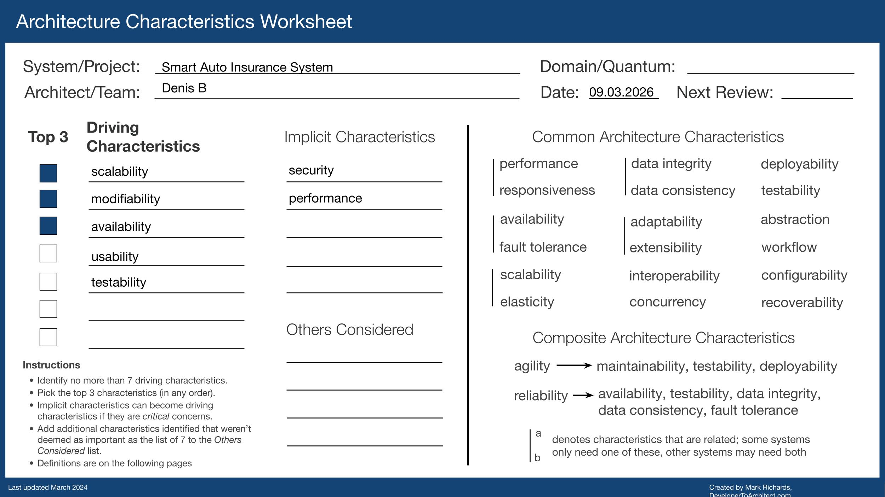

### Допущения

* **ASM-1**: Датчик телеметрии прост в установке на любой автомобиль. Датчик собирает необходимую и достаточную информацию для расчета как базовых, так и сложных метрик стиля вождения;
* **ASM-2**: Датчик телеметрии подключен к модему сотовой связи (4G/5G) и отправляет данные в режиме on-line через протокол MQTT поверх TLS в возможностью доотправки накопленных данных при отсутствии сети;
* **ASM-3**: У страховой компании широкая сеть партнерских ТО для авто, проблем с установкой/ремонтом датчиков телеметрии не будет. Тема вознаграждение станциям ТО за оказанные услуги выходит за рамки проекта;

### Ограничения

* **CON-1**: Технологический стек команды разработки: ASP.Net Core 9 для бэкенда и фреймворк Angular + TypeScript для фронтенда;
* **CON-2**: Рекомендуется использование центрадивованных платформенных сервисов предприятия: Kafka для асинхронной передачи данных, Prometheus + Zipkin + ELK-stack + Grafana для метрик, трейсинга, логирования и алертинга соответственно;
* **CON-3**: Для хостинга рекомендуется использовать корпоративный кластер k8s, если нет строгих требования ИБ к хостингу на изолированных VM;

## Архитектура

### Модель предметной области

Выдлеены основные домены системы:

- **Telemetry**. Получение, агрегация, первичная аналитика и формирование поездок из данных телеметрии, отправляемых с датчиков авто клиентов системы. Поддерживающий домен;
- **DrivingAnalitycs**. Формирование поездок с рассчетными метриками стиля вождения, расчет коэффициента стиля вождения, профиль стиля вождения. Ядро системы;
- **Pricing**. Расчет прогнозной стоимости полиса, обновление текущей стоимости полиса. Ядро системы;
- **PoliceManagement**. Просмотр и управление полисом в личном кабинете клиента. Ядро системы;
- **Support**. Поддержка клиентов через выделенные каналы связи, включая ТО датчиков. Generic домен;
- **Recommendations**. Рекомандации клиенту на основе его профиля вождения. Пожжерживающий домен;
- **Notifications**. Уведомления клиенту по выделенным каналам связи. Поддерживающий домен.

<!-- #region mermaid: SH системы умного автострахования -->
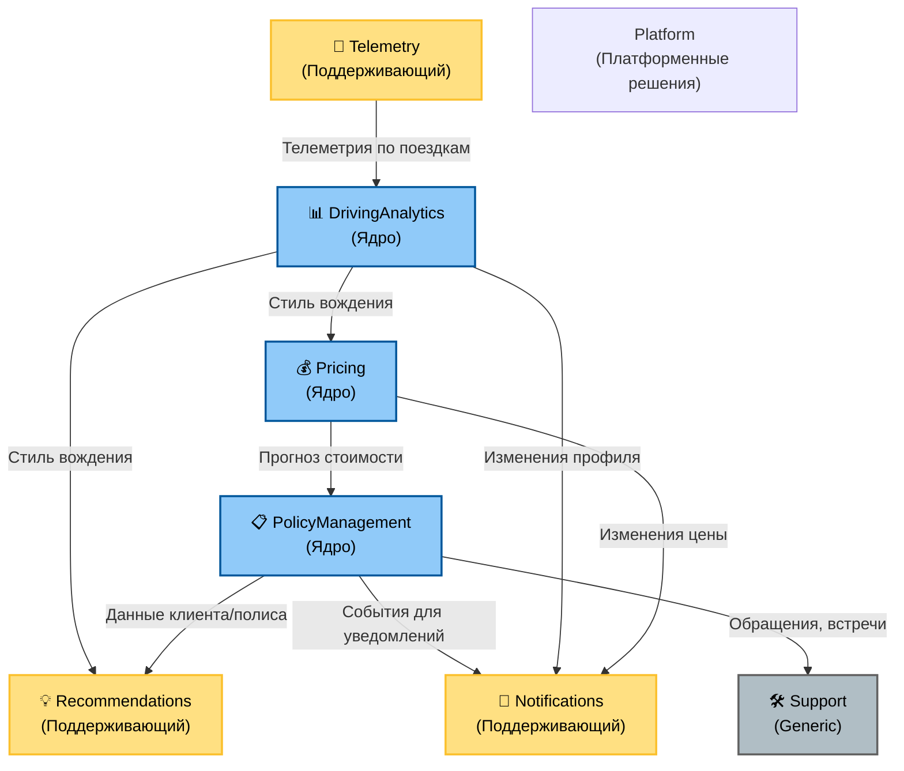
```mermaid
graph TD
    classDef core fill:#90caf9,stroke:#01579b,stroke-width:2px,color:#000000;
    classDef supporting fill:#ffe082,stroke:#fbc02d,stroke-width:2px,color:#000000;
    classDef generic fill:#b0bec5,stroke:#616161,stroke-width:2px,color:#000000;

    Telemetry["📡 Telemetry<br/>(Поддерживающий)"]:::supporting
    DrivingAnalytics["📊 DrivingAnalytics<br/>(Ядро)"]:::core
    Pricing["💰 Pricing<br/>(Ядро)"]:::core
    PolicyManagement["📋 PolicyManagement<br/>(Ядро)"]:::core
    Support["🛠️ Support<br/>(Generic)"]:::generic
    Recommendations["💡 Recommendations<br/>(Поддерживающий)"]:::supporting
    Notifications["🔔 Notifications<br/>(Поддерживающий)"]:::supporting
    Platform["Platform<br/>(Платформенные решения)"]

    Telemetry -->|Телеметрия по поездкам| DrivingAnalytics
    DrivingAnalytics -->|Стиль вождения| Pricing
    Pricing -->|Прогноз стоимости| PolicyManagement
    DrivingAnalytics -->|Стиль вождения| Recommendations
    PolicyManagement -->|Данные клиента/полиса| Recommendations
    PolicyManagement -->|События для уведомлений| Notifications
    DrivingAnalytics -->|Изменения профиля| Notifications
    Pricing -->|Изменения цены| Notifications
    PolicyManagement -->|Обращения, встречи| Support
```
<!-- #endregion -->

### Архитектурно значимые требования и критические сценарии

- *При пиковой экплуатации авто в часы пик* (7-9 утра и 17-20 по местному времени) домен **Telemetry** должен обрабатывать сырые данные телеметрии, формировать поездки и передавать события в домен **DrivingAnalytics** не дольше, чем *через 5 минут после завершения каждой поездки*;
- Домен **DrivingAnalytics** должен формировать поездки с метриками стиля вождения не более, чем *за 15 минут* с момента завершения поездки *в любое время суток*;
- Домен **DrivingAnalytics** *в течение ночи (00-06 утра по местному времени)* должен обновить профиль стиля вождения для каждого клиента (*до 100 тыс*), включая расчет стоимости полиса;
- Бизнес-логика расчета метрик стиля вождения и его коэффициента *должны быть инкапсулированы* в отдельных сервисах домена **DrivingAnalytics**. Изменения в бизнес-логики не должны затрагивать остальные домены, включая **Telemetry**;
- *При недоступности внешних систем и сервисов* домены **PolicyManagement** и **Pricing** *должны отбражать пользователю закэшированные значения и уведомлять о неточности в расчетах на текущий момент врвмени*;
- 

### Выбор архитектурного стиля

Руководствуясь основными тремя атрибутами качества системы:

* **Доступность**
* **Масштабируемость**
* **Модифицируемость**

для системы предпочтительным стилем является комбинация микросервисной и событийной архитектуры ввиду:

* Независимой масштабируемости отдельных микросервисов в разных доменах системы;
* Слабой связности между микросервисами, а значит высокой модифицируемости, включая сервисы расчетов метрик стиля вождения;
* Доступности всей системы при отказе одного или нескольких сервисов при корректной реализации.

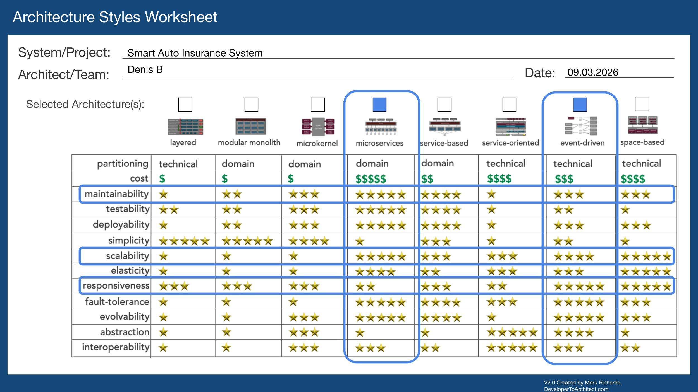

### Контекст системы

На схеме контекста системы (уровень C1 нотации C4) представлены основные пользователи и внешние зависимости

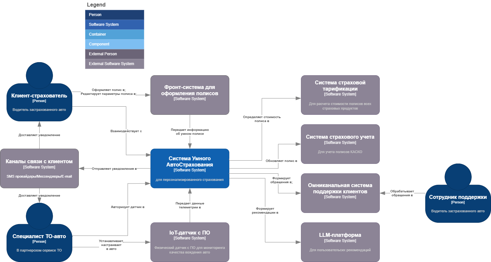

### Контейнеры

Функциональная декомпозиция на сервисы внутри выделенных доменов представлена в [ADR-1](ADR/ADR-1-functional-decomposition.md)

### Sequence-диаграммы

* Для группировки нескольких сервисов выделены домены;
* Для упрощения чтения схем в некоторых UC опущены операции с БД  

#### UC-1.1 Оформление умного полиса: передача данных из фронт-системы

**Прдусловие**: клиент оформил "умный" полис автострахования в одной из фронт-систем

Для учета полиса с динамическим ценнобразованием и начала его эксплуатации клиентом фронт-системы должны передать в систему умного автострахования информацию про о полисе, страхователе и его авто. Точкой входа для внешних систем является External API Gateway (см. [ADR-2](ADR/ADR-2-gateways.md)). На выходе из данного сценария:
* созданы профили клиента и стиля вождения, которые находятся в ожидании подключения и эксплуатации датчика телеметрии;
* клиент получил уведомление по SMS с ссылкой на авторизацию в приложении умного автострахования.

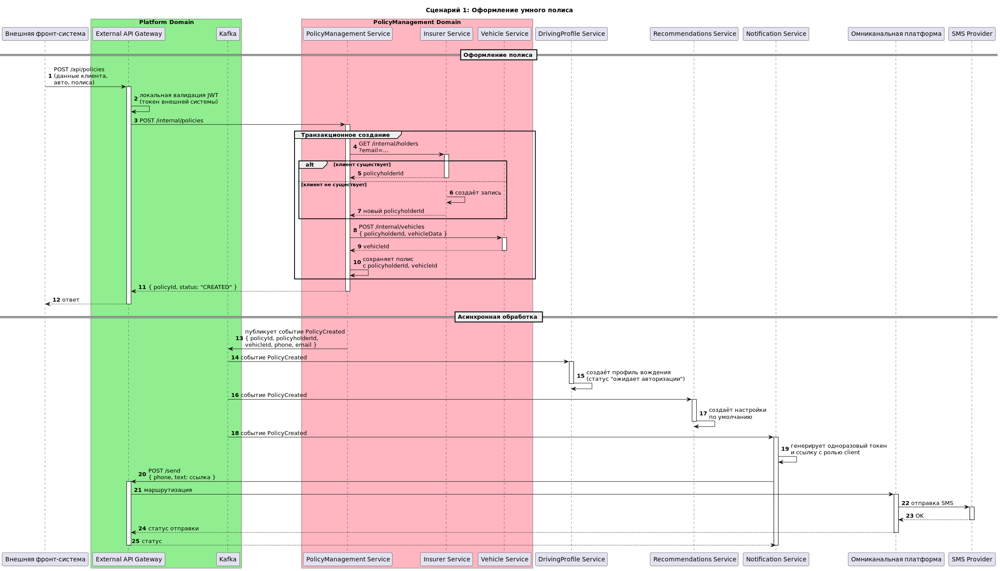

#### UC-1.2 Оформление умного полиса: аутентификация и авторизация клиента

**Предусловие**: выполнены шаги UC-1.1

Для авторизации и аутентификации клиента в системе используется корпоративный KeyCloak (см. [ADR-3](ADR/ADR-3-auth-actors.md)), для обеспечения 2FA используется интеграция с SMS-провайдером с Keycloak. Данные, необходимые приложению для отображения клиенту, получает и агрегирует отдельный сервис BackendForFrontend в системе (см. [ADR-4](ADR/ADR-4-get-data-for-frontend.md)), который взаимодействует с сервисами системы параллельными синхронными запросами. 
На выходе из данного сценария:
* клиент авторизован в системе;
* клиент может просматривать основные разделы приложения.  

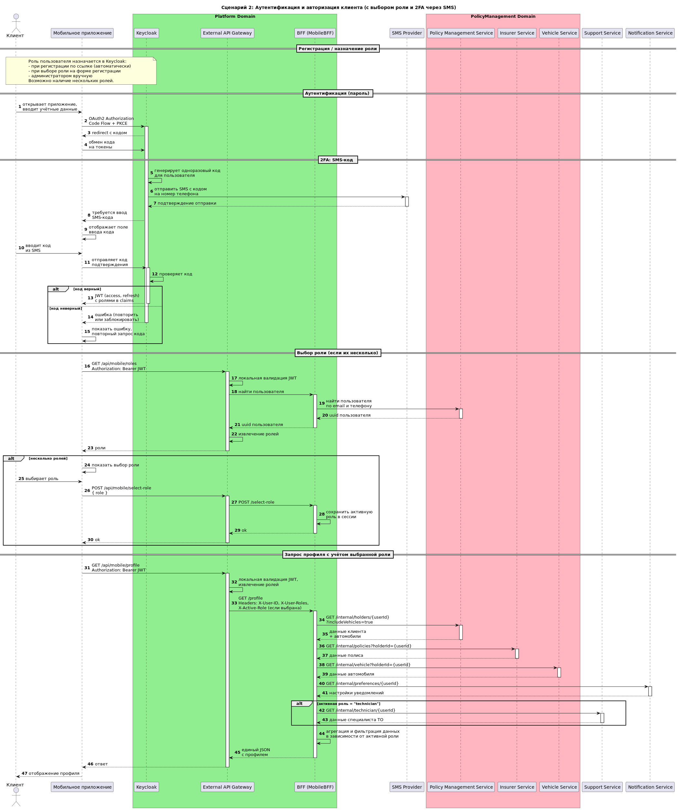

#### UC-2-3. Инициация встречи и установка датчика телеметрии

**Предусловие**: выполнены шаги UC-1, специалист ТО зарегистрирован в системе, отделение партнерской сети ТО имеет в наличии датчики телеметрии, готовые для установки.

Авторизованный пользователь в приложении назначает встречу, выбирая свободный слот по календарю в кокретном сервисе-партнере. Сотрудник ТО в приложении подтверждает встречу. Клиент приезжает на визит в сервис ТО, где мастер устанавливает в авто датчик телеметрии, предварительно его распаковав и зарегистрировав в системе.
На выходе из данного сценария:
* датчик телеметрии установлен в авто клиента и готов к эксплуатации;
* встреча по установке датчика находится в конечном статусе в ЛК клиента и мастера ТО.  

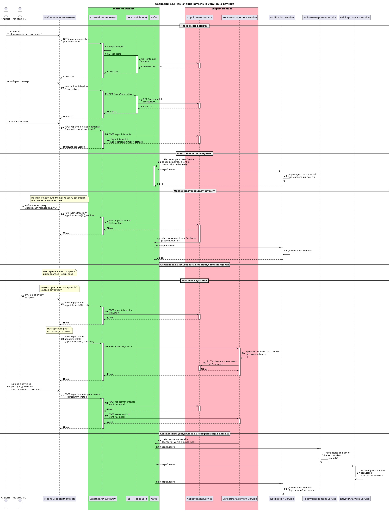

#### UC-4.1 Эксплуатация датчика телеметрии. Получение данных телеметрии и формирвоание поездок

**Предусловие**: выполнены шаги UC-2-3

При эксплуатации авто датчики отправляют в контур страховщика необходимые данные телеметрии (см. *ASM-1*), которые, по требованиям ИБ, сначала попадают в изолированный во VLAN контур со Шлюзом телеметрии, который маршрутизирует запросы в топик отдельного кластера Kafka, который развернут специально для использования телеметрии IoT в компании. Данные сохраняются отдельным контейнером в БД для данных телеметрии с поддержкой временных рядов и геометок (см. [ADR-5](ADR/ADR-5-db-for-telemetry-data.md)), агрегируются в поездки отдельным сервисом вместе с расчетом базовых метрик стиля вождения (см. [ADR-6](ADR/ADR-6-read-telemetry-form-trips.md)).

На выходе из данного сценария:
* данные телеметрии агрегируются по поездкам в системе;
* поездки с базовыми метриками готовы для расчета прогнозной стоимости полиса. 

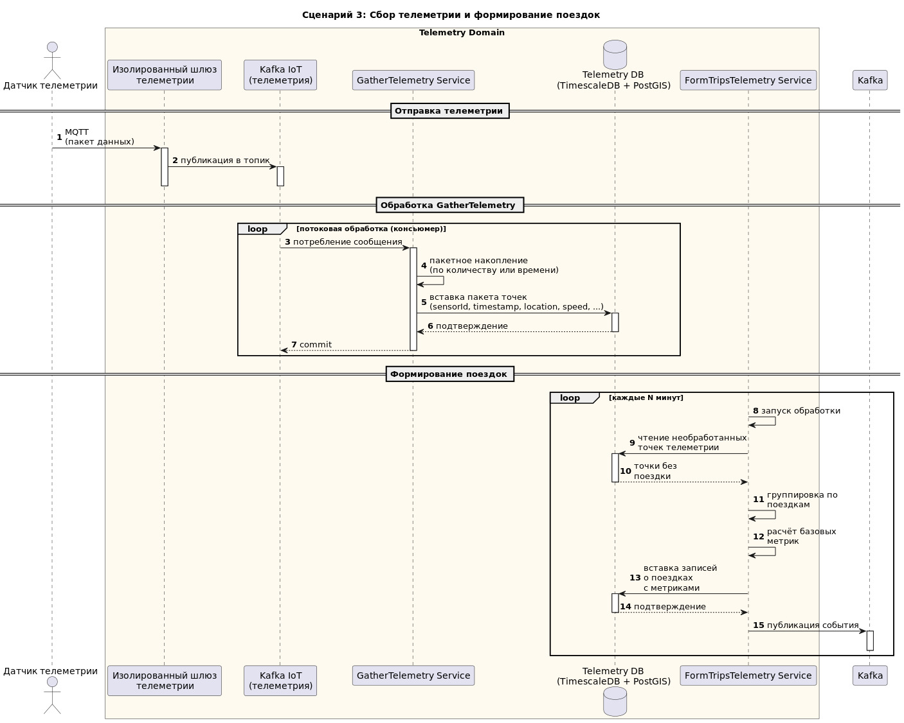

#### UC-4.2 Эксплуатация датчика телеметрии. Расчет коэффициента стиля вождения для прогнозирования стоимости

**Предусловие**: из Telemetry Domain создано событие, содержащее данные по поездки с базовыми расчетными метриками стиля вождения и данными GPS (UC-4.1).

Сервис FormTripsTelemetry Service подхватывает событие каождой завершенной поездки, рассчитывает метрики стиля вождения (должны быть модифицируемы по требованию заказчика) и записывает поездку с метриками в БД Домена DrivingAnalytics. CalculateDrivingCoefficient Service запускается каждую ночь и рассчитывает по поездкам коэффициент стиля вождения на осове метрик, читая данные из той же БД. 

Принято решение хранить данные в домене DrivingAnalytics в единой БД с репликой для CQRS (cм. [ADR-7](ADR/ADR-7-db-for-driving-analytics.md)). 
Принято решение отправлять событие о формировании поездок с базовыми метриками из TelemetryDomain в Kafka с ссылкой на объект в MinIO S3, в котором будут содержаться метрики в привязке к геоданным (см. [ADR-8](ADR/ADR-8-send-trips-data-async.md)). Данные объект из MinIO будет так же использовать BFF-сервис для отрисовки карты поездок для пользователя. 

За событием обновленного коэффициента следует PricingDomain и PolicyManagement Domain, которые узнают актуальную стоимость полиса и учитывают изменения в системе страхового учета соответственно.

На выходе из данного сценария:
* обновленная прогнозная/реальная стоимость полиса на следующий месяц;
* обновленный профиль вождения с метриками.

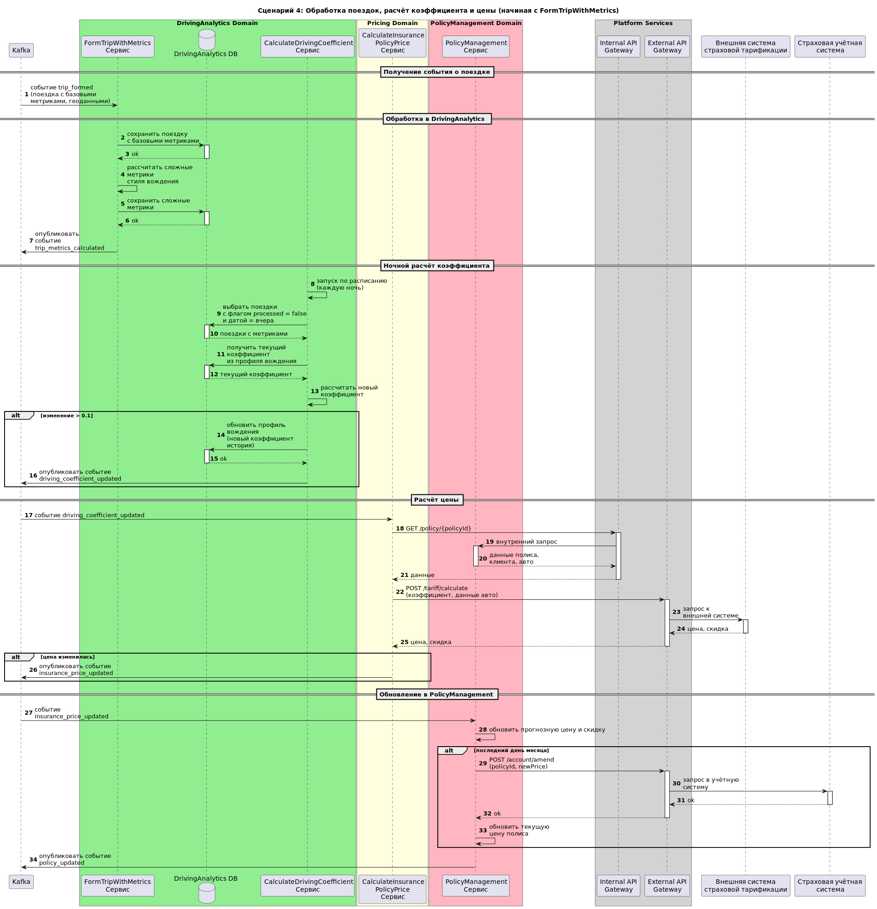

#### UC-4.3 Эксплуатация датчика телеметрии. Формирования рекомендаций для клиента

**Предусловие**: завершился очередной календарный месяц эксплуатации датчика телеметрии, у клиента включена опция рекомандаций по стилю вождения.

ADR-9 получение данных по поездкам с геоданными
ADR-10 отправка только нужных данных для рекомендации в LLM

На выходе из данного сценария:
* клиент получил список рекомендаций на основе собранных за месяц данных по поездкам.

### Database-диаграмма

### Deployment-диаграмма

### Сценарии отказоусточивости

### Сценарии модифицируемости
